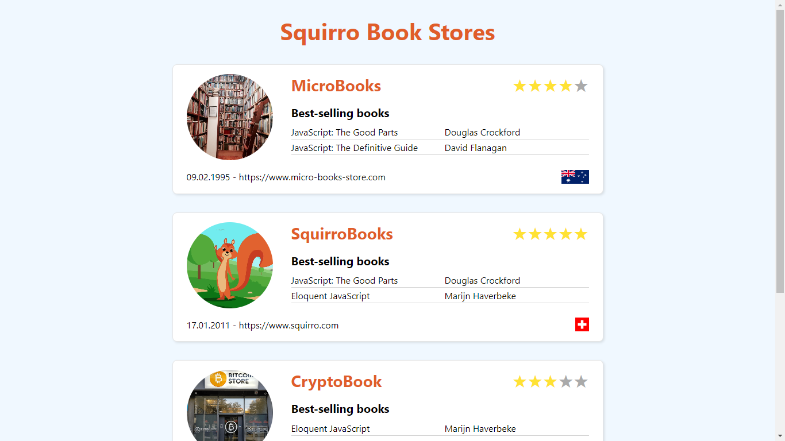

## Squirro Frontend Coding Challenge

This repo contains two folders that constitute each other to create an application that lists the best-selling books for each book store. The book-store-api folder contains the JSON:API based server which provides the data for the book stores. The book-store-frontend folder contains the responsive React application that displays the data according to the requirements of the coding challenge.



### Running the application

Clone this repo locally

```
git clone https://www.github.com/freddyz00/squirro-frontend-coding-challenge
cd squirro-frontend-coding-challenge
```

#### book-store-api

- `cd` into `book-store-api` and run `npm install`
- Start the server on port 3001 by running `npm start`

#### book-store-frontend

- Once the server has started, `cd` into `book-store-api` and run `npm install`
- Start the React application on port 3000 by running `npm start`
